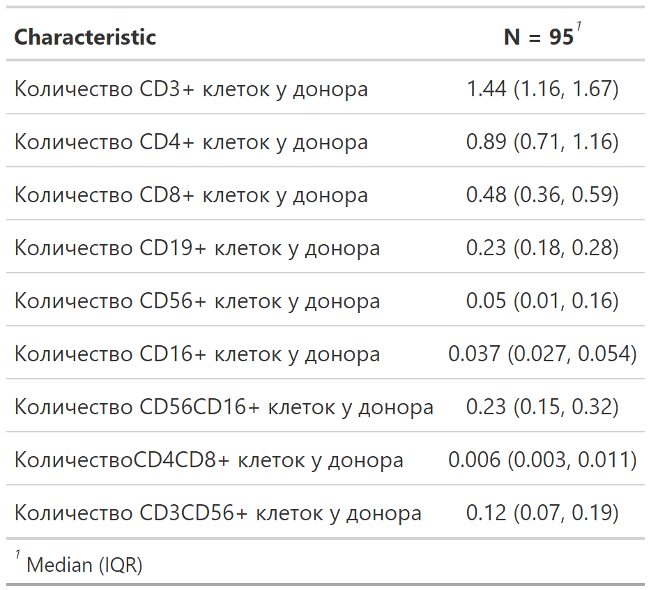

Descriptive statistics
================
Polina Burmakina
2024-01-16

- Statistics for the outcomes

``` r
tab1 <- main_df %>%
  select(os2, os2time, 
         rel2, rel2time, 
         compete2, compete2time, 
         efs2, efs2time, 
         a_gvhd24, a_gvhd24time, 
         c_gvhd, c_gvh_dtime) %>%
  tbl_summary(statistic = list(
    all_continuous() ~ "{median} ({p25}, {p75})",
    all_categorical() ~ "{n} ({p}%)"),
    missing = "no")
```
<!-- -->

- Statistics for predictors used in the 0-model

``` r
tab2 <- main_df %>%
  select(d_z, restadirovanie_na_moment_tkm_stadia_pred_tk_me,  
         vozrast_polnyh_let_na_moment_tkm, vozrastnaa_gruppa, 
         sovmestimost_donora_recipienta_ptkm_pred_tk_me, 
         rezim_kondicionirovania_pred_tk_me, 
         vid_tkm_nastoasej_ptkm_pred_tk_me_pditkm, 
         cd34_kg_x10_ptkm_pdi) %>%
  tbl_summary(statistic = list(
    all_continuous() ~ "{median} ({p25}, {p75})",
    all_categorical() ~ "{n} ({p}%)"), 
    missing = "no")
```
<!-- -->

- Statistics for potential predictors

``` r
tab3 <- main_df %>% 
  select(matches("^cd.*_abs$")) %>% 
  
  
  tbl_summary(statistic = list(
    all_continuous() ~ "{median} ({p25}, {p75})",
    all_categorical() ~ "{n} ({p}%)"), 
    missing = "no")
```
<!-- -->


## Do we have missing values in the data used to build the model?

- Missing values in potential predictors

``` r
main_df %>%
  select(matches("^cd.*_abs$")) %>% 
  vis_miss() 
```

<!-- -->

- Missing values in outcomes

``` r
main_df %>%
  select(os2, os2time, 
         rel2, rel2time, 
         compete2, compete2time, 
         efs2, efs2time, 
         a_gvhd24, a_gvhd24time, 
         c_gvhd, c_gvh_dtime) %>%
  vis_miss()
```

<!-- -->

Missing values about 3%
