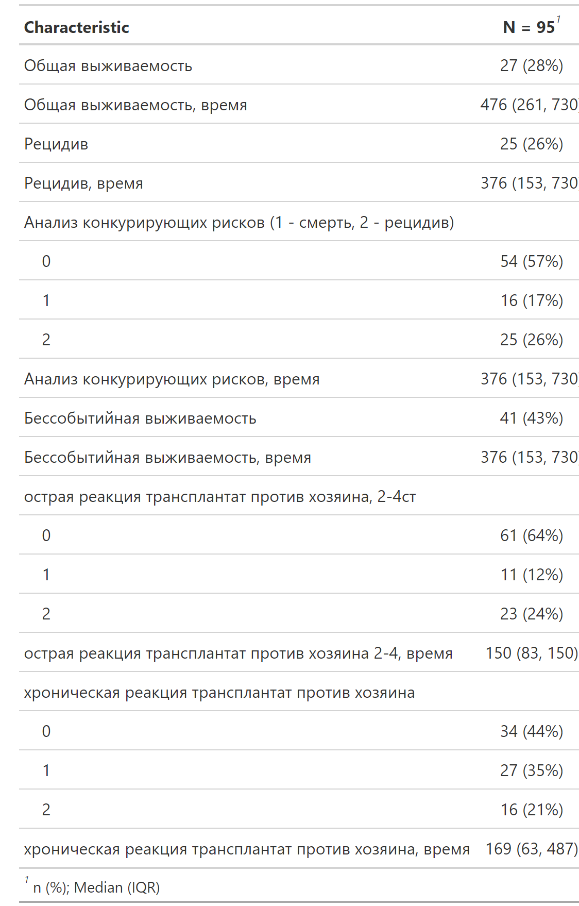
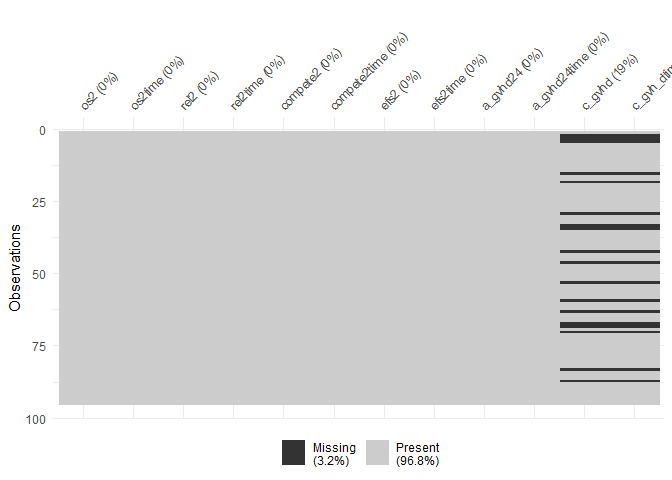
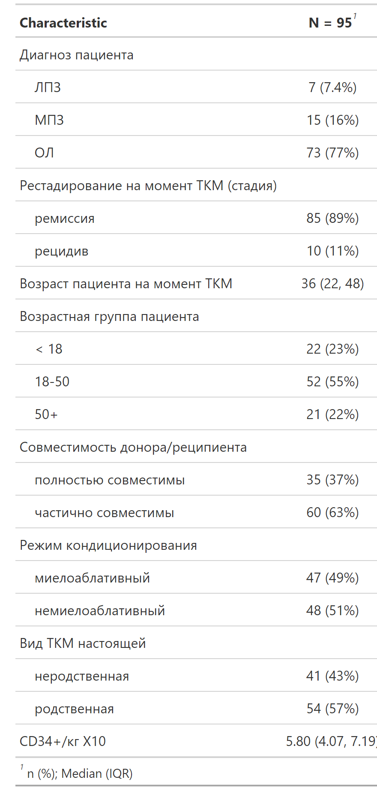
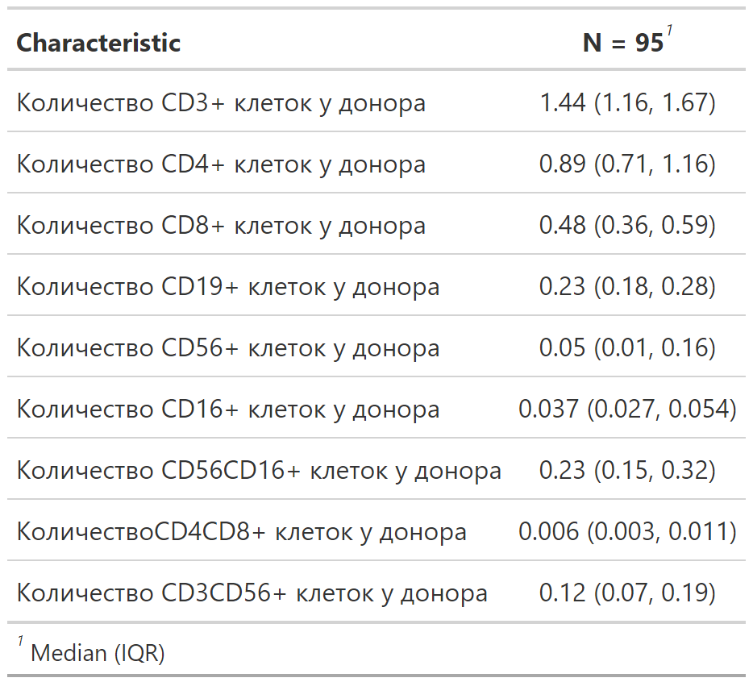
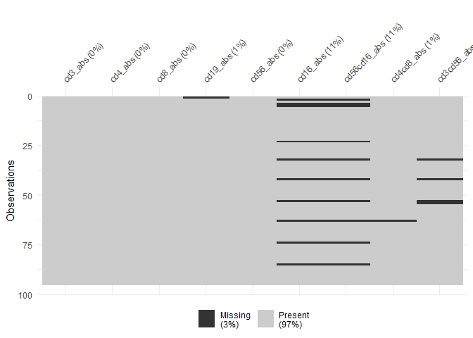
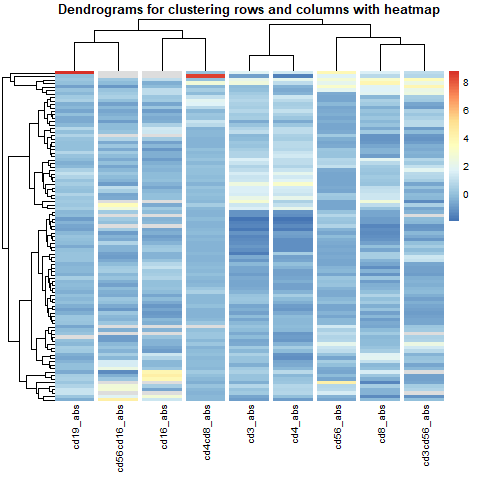
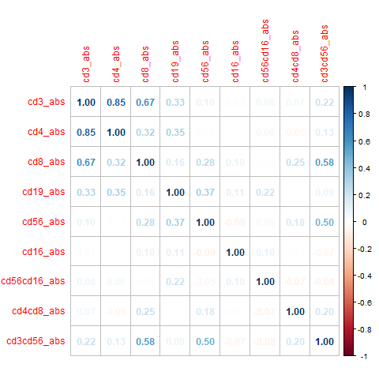

# Association of the donor immunological status with the outcomes of allogeneic hematopoietic stem cell transplantation using posttransplantation cyclophosphamide

## Background

Despite the active development of targeted and immunotherapy, allo-HSCT (allogeneic hematopoietic stem cell transplantation) remains one of the important options for patients with hematological malignancies. However, this procedure is associated with a multitude of risks, and one of the main life-threatening complications is GVHD (graft-versus-host disease).

Numerous prophylactic regimens for GVHD have been developed, and in recent years, prophylaxis with cyclophosphamide has gained popularity due to its demonstrated high clinical efficacy. However, the biological effects of cyclophosphamide and its impact on recipient immune reconstitution remain not fully understood, and this issue is currently actively researched. A research team has already conducted a study involving patients receiving Cy, which demonstrated an association between the cellular composition of the transplant on one hand, and immune reconstitution (and consequently, survival) and the likelihood of developing severe GVHD on the other. Consequently, the idea of a possible association with the peripheral blood composition of the donor has emerged, which would allow predicting transplantation outcomes based on analysis of the donor's peripheral blood even before the donation procedure.

This suggests the potential for pre-transplant screening based on donor peripheral blood analysis, enhancing the ability to predict transplantation outcomes and tailor interventions accordingly.

## Purpose
The purpose of this study is to identify potential predictors of allo-HSCT outcomes based on the immunological characteristics of the donor’s peripheral blood.

### Objectives
1. Preprocessing complex data
2. Descriptive statistics to describe donor & patient characteristics, HSCT procedure and its outcomes
3. Identification of outcomes and their potential predictors
4. Exploratory analysis:
- Identification of correlated variables (correlation analysis, clustering, principal component analysis)
- Identification of associations (univariate regression analysis)
5. Assessment of the potential association between donor immunological characteristics and allogeneic HSCT outcomes
6. Development of a model including immunological and other characteristics to predict allogeneic HSCT outcomes
7. Model quality assessment (added predictive value)

## Results

### Describtive statistics
1. Description of HSCT outcomes: overall survival, event-free survival, death, acute and chronic GVHD and the time until each outcome
  <!-- -->
* Missing values in outcomes:
  <!-- -->
2. Description of known HSCT predictors:
* We analyzed data from 95 patients diagnosed with acute leukemia (77%), myeloproliferative (16%), and lymphoproliferative disorders (7%). The majority (89%) of patients are currently in remission. Transplantations were conducted using both myeloablative (49%) and non-myeloablative (51%) regimens, with both related (57%) and unrelated (43%) donors. Donor-recipient pairs included both fully matched (37%) and partially matched (63%) cases. Additionally, the analysis encompassed patients across various age groups, including those under 18 years old (23%). Median follow-up time was 476 days.
  <!-- -->
3. Description of potential HSCT predictors: absolut amounts of CD3+, CD4+, CD8+, CD19+, CD56+, CD16+, CD56CD16+, CD4CD8+, and CD3CD56+ cells х10^9/л
  <!-- -->
* Missing values for potential predictors:
  <!-- -->
 

### Exploratory analysis:
### 1. Correlation analysis, clustering, PCA

<!-- -->

<!-- -->

PCA results confirm the result of correlation analysis:

 

### 2. Univariate regression analysis
1. Overall survival

2. Relapse

3. Event-free survival

4. Event-free mortality

5. Acute GVHD

6. Chronic GVHD

Heatmap with p-values

### Multiple Cox regression models: selection of predictors, calculation of added value

In the Cox regression model for assessing outcomes (overall survival, event-free survival, death, acute and chronic GVHD), the predictors included were age, diagnosis, disease stage, conditioning regimen, donor-recipient compatibility, type of transplantation, and the number of CD34 cells/kg. This model was taken as the null model, followed by the calculation of Harrell's C-index for this model and for a model with new potential predictors selected using LASSO method with resampling. Resampling was conducted using the bootstrap method (R = 1000). Subsequently, the distributions of metrics were evaluated with 95 % confidence intervals for the C-index values distribution, along with the distribution of added value for each outcome. This method was successfully applied to the outcomes of relapse, event-free survival, overall survival and chronic GVHD, and failed to death and acute GVHD possibly due to the limited number of outcomes, sample size, and distribution of values of categorical predictors.

Harrell's C-index values are present in [Table 1](https://github.com/GChernaya/CYTO7/blob/main/table1.html). Parameters considered as potential new predictors of outcomes (event-free survival, chronic GVHD) demonstrated added value less than 3% (Table 2), despite statistically significant differences in the available data for all variables except amount of CD16+ and CD3CD56+ cells.

## Conclusion and further plans

The clinical significance of the effect of parametres, included in analysis, raises doubts. 
The approach used to select for new predictors may not be suitable for rare outcomes; therefore, it may be worthwhile to consider alternative methods for new predictor selection.

Further plans:
1. Develop pipeline for appropriate imputation.   
2. Apply developed pipeline for selection of predictors to imputed data.
3. Apply methods for rare outcomes

### References
1. Moiseev IS, et al. High prevalence of CD3, NK, and NKT cells in the graft predicts adverse outcome after matched-related and unrelated transplantations with post transplantation cyclophosphamide. Bone Marrow Transplant. 2020 Mar;55(3):544-552. https://doi.org/10.1038/s41409-019-0665-3
2. Zhao, C., Bartock, M., Jia, B. et al. Post-transplant cyclophosphamide alters immune signatures and leads to impaired T cell reconstitution in allogeneic hematopoietic stem cell transplant. J Hematol Oncol 15, 64 (2022). https://doi.org/10.1186/s13045-022-01287-3
3. Nakamae H, Fujii K, Nanno S, et al. A prospective observational study of immune reconstitution following transplantation with post-transplant reduced-dose cyclophosphamide from HLA-haploidentical donors. Transpl Int. 2019;32(12):1322-1332. doi:10.1111/tri.13494
4. https://github.com/JanMarvin/openxlsx2
5. https://cran.r-project.org/web/packages/janitor/vignettes/janitor.html
6. https://r4ds.had.co.nz/strings.html#matching-patterns-with-regular-expressions
7. https://github.com/georgheinze/coxphf

